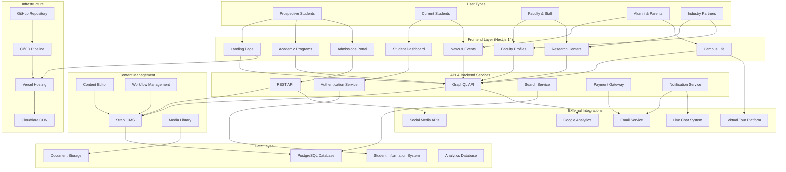
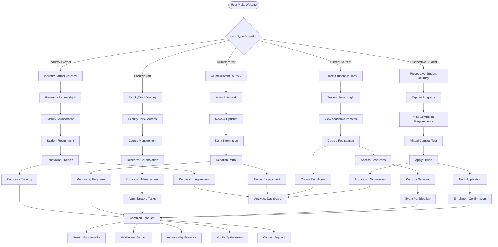
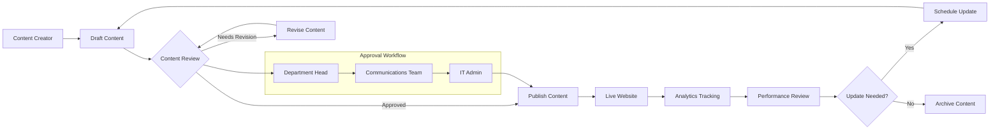

# UAP Website Mermaid Diagrams for MS Word Documentation

## Diagram 1: Website Architecture

## Diagram 2: User Journey Flow

## Diagram 3: Information Architecture

```mermaid
graph TD
    A[UAP Website Home] --> B[Academics]
    A --> C[Admissions]
    A --> D[Research]
    A --> E[Campus Life]
    A --> F[About UAP]
    A --> G[News & Events]

    B --> B1[Undergraduate Programs]
    B --> B2[Graduate Programs]
    B --> B3[Faculty Directory]
    B --> B4[Academic Calendar]
    B --> B5[Course Catalog]

    B1 --> B1a[Engineering]
    B1 --> B1b[Business]
    B1 --> B1c[Social Sciences]
    B1 --> B1d[Architecture]

    C --> C1[How to Apply]
    C --> C2[Requirements]
    C --> C3[Scholarships]
    C --> C4[International Students]
    C --> C5[Application Portal]

    D --> D1[Research Centers]
    D --> D2[Publications]
    D --> D3[Research Projects]
    D --> D4[Collaborations]
    D --> D5[Innovation Hub]

    E --> E1[Student Life]
    E --> E2[Clubs & Organizations]
    E --> E3[Sports & Recreation]
    E --> E4[Campus Facilities]
    E --> E5[Student Services]

    F --> F1[History & Mission]
    F --> F2[Leadership]
    F --> F3[Rankings & Recognition]
    F --> F4[Campus & Locations]
    F --> F5[Contact Information]

    G --> G1[Latest News]
    G --> G2[Events Calendar]
    G --> G3[Announcements]
    G --> G4[Media Gallery]
    G --> G5[Press Releases]
```

## Diagram 4: Content Management Workflow

---

**Instructions for MS Word Integration:**

1. Copy the Mermaid code from each diagram section
2. Use an online Mermaid editor (like mermaid.live) to generate PNG/SVG images
3. Insert the generated images into your MS Word document
4. Add appropriate captions and references to each diagram
5. Ensure diagrams are sized appropriately for document layout

**Alternative Method:**
- Use Mermaid plugins available for MS Word
- Or convert diagrams to Visio format for better integration with Office suite

*Diagram Source File*  
*Version: 1.0*  
*Date: July 19, 2025*  
*Project: UAP Website Redesign*
